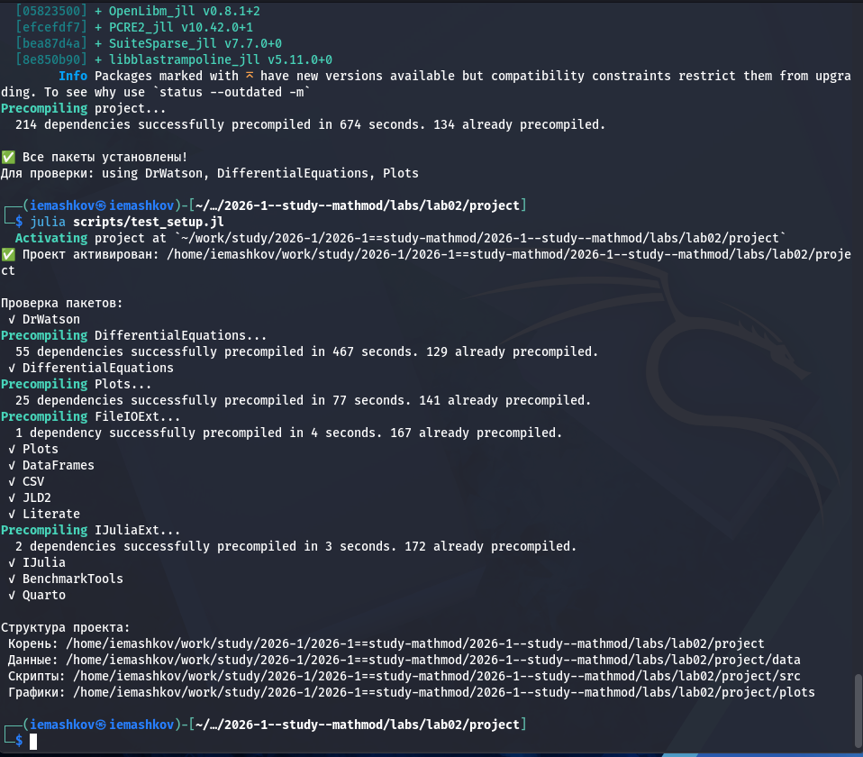
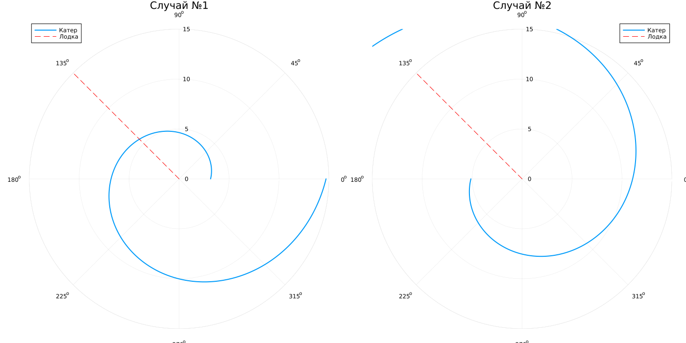

---
## Author
author:
  name: Машков И.Е.
  email: 1132231984@rudn.ru
  affiliation:
    - name: Российский университет дружбы народов
      country: Российская Федерация
      postal-code: 117198
      city: Москва
      address: ул. Миклухо-Маклая, д. 6

## Title
title: "Отчёт по лабораторной работе №2"
subtitle: "Математическое моделирование"
license: "CC BY"
---

# Цель работы

Решить задачу о погоне с помощью Julia

# Задание 

На море в тумане катер береговой охраны преследует лодку браконьеров. Через определенный промежуток времени туман рассеивается, и лодка обнаруживается на расстоянии 16,4 км от катера. Затем лодка снова скрывается в тумане и уходит прямолинейно в неизвестном направлении. Известно, что скорость катера в 4,2 раза больше скорости браконьерской лодки.
1. Запишите уравнение, описывающее движение катера, с начальными условиями для двух случаев (в зависимости от расположения катера относительно лодки в начальный момент времени).
2. Постройте траекторию движения катера и лодки для двух случаев.
3. Найдите точку пересечения траектории катера и лодки.

# Выполнение лабораторной работы

## Подготовка пространства

Создаю базовые скрипты для установки необходимых пакетов, проверки структуры и создания производных форматов ([рис. @fig-001]).

{#fig-001 width=70%}

## Решение задания

Необходимо было записать уравнение, описывающее движение катера с начальными условиями для двух случаев, построить траекторию катера и найти точки пересечения катера и лодки. Получил следующий график ([рис. @fig-002]). 
 
{#fig-002 width=70%}

Далее, с помощью tangle создаю производные форматы своего скрипта, в отчёте использую qmd версию:



# Выводы

Во время выполнения данной лабораторной работы были получены точки пересечения катера и лодки, а также построены два графика с полярными системами координат.

