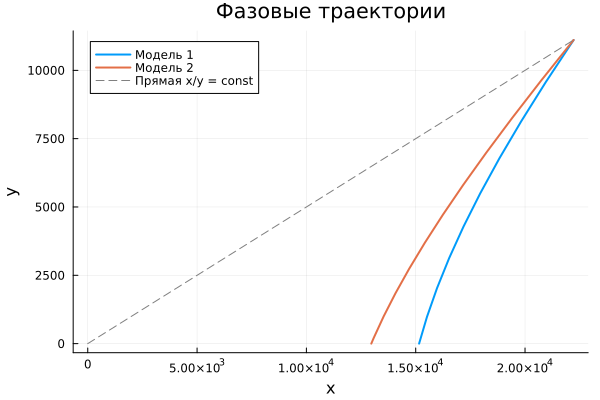

---
## Author
author:
  name: Машков Илья Евгеньевич
  email: 1132231984@rudn.ru
  affiliation:
    - name: Российский университет дружбы народов
      country: Российская Федерация
      postal-code: 117198
      city: Москва
      address: ул. Миклухо-Маклая, д. 6
## Title
title: Лабораторная работа №3
subtitle: Математическое моделирование
license: CC BY
date: 2026-09-04
date-format: "YYYY-MM-DD"
---

## Цель работы

Изучение модели боевых действий

## Выполнение лабораторной работы

{width=70%}

## Выполнение лабораторной работы

{width=70%}

## Выполнение лабораторной работы

Модель 1: x_final = 15154.582746599488,y_final = 1.1265716643962072e-12 (t = 0.8959735762601861)

Модель 2: x_final = 12968.052162528438,y_final = 2.1559117667378927e-12 (t = 1.0260821028203877)

Модель 1: Армия X победила

Модель 2: Армия X победила

## Выводы

Во время выполнения данной лабораторной работы я воспроизвёл модель боевых действий, получил графики и т.д.

