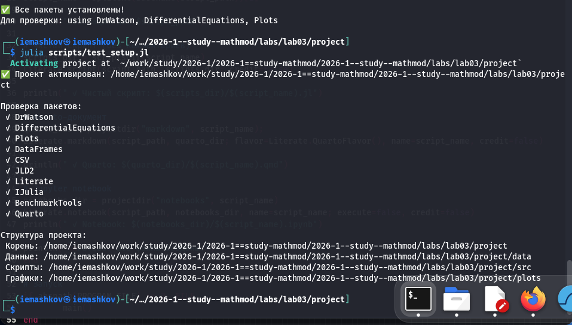
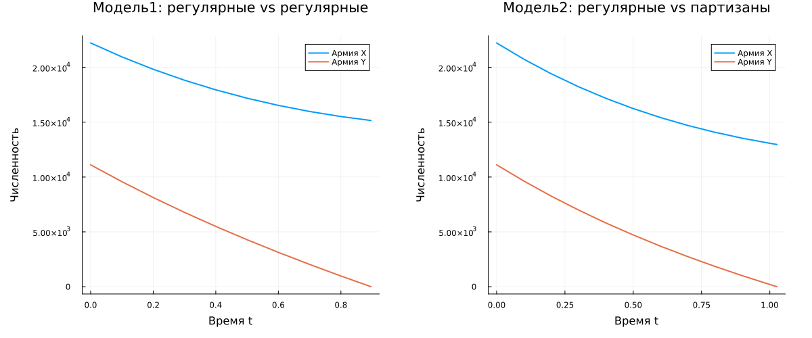

---
## Author
author:
  name: Машков И.Е.
  email: 1132231984@rudn.ru
  affiliation:
    - name: Российский университет дружбы народов
      country: Российская Федерация
      postal-code: 117198
      city: Москва
      address: ул. Миклухо-Маклая, д. 6

## Title
title: "Отчёт по лабораторной работе №3"
subtitle: "Математическое моделирование"
license: "CC BY"
---

# Цель работы

Изучение модели боевых действий

# Задание 

Между страной Х и страной У идет война. Численность состава войск исчисляется от начала войны, и являются временными функциями x(t) и y(t). В начальный момент времени страна Х имеет армию численностью 22 222 человек, а в распоряжении страны У армия численностью в 11 111 человек. Для упрощения модели считаем, что коэффициенты a, b, c, h постоянны. Также считаем P(t) и Q(t) непрерывные функции.
Постройте графики изменения численности войск армии Х и армии У для следующих случаев:

1. Модель боевых действий между регулярными войсками
2. Модель ведение боевых действий с участием регулярных войск и партизанских отрядов

# Выполнение лабораторной работы

## Подготовка пространства

Создаю базовые скрипты для установки необходимых пакетов, проверки структуры и создания производных форматов ([рис. @fig-001]).

{#fig-001 width=70%}

## Решение задания

У меня снова 45 вариант. У меня есть армия из 22222 человек у X и 11111 у Y. Необходимо было выяснить победителя в двух случаях: регулярные vs регулярные и регулярные vs партизаны. Таже было необходимо построить графики изменения численности войск обоих армий ([рис. @fig-002]) и фазовые портреты ([рис. @fig-003]). 
 
{#fig-002 width=70%}
 
{#fig-003 width=70%}

Далее, с помощью tangle создаю производные форматы своего скрипта, в отчёте использую qmd версию:



# Выводы

Во время выполнения данной лабораторной работы я воспроизвёл модель боевых действий, получил графики и т.д.

