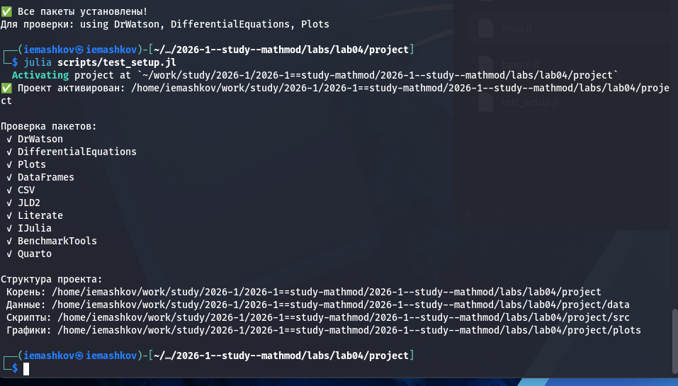

---
## Author
author:
  name: Машков И.Е.
  email: 1132231984@rudn.ru
  affiliation:
    - name: Российский университет дружбы народов
      country: Российская Федерация
      postal-code: 117198
      city: Москва
      address: ул. Миклухо-Маклая, д. 6

## Title
title: "Отчёт по лабораторной работе №4"
subtitle: "Математическое моделирование"
license: "CC BY"
---

# Цель работы

Реализация модели гармонических колебаний.

# Задание 

Постройте фазовый портрет гармонического осциллятора и решение уравнения
гармонического осциллятора для следующих случаев

1. Колебания гармонического осциллятора без затуханий и без действий внешней силы
2. Колебания гармонического осциллятора c затуханием и без действий внешней силы
3. Колебания гармонического осциллятора c затуханием и под действием внешней силы

На интервале [0; 58] (шаг 0.05) 

# Выполнение лабораторной работы

## Подготовка пространства

Создаю базовые скрипты для установки необходимых пакетов, проверки структуры и создания производных форматов ([рис. @fig-001]).

{#fig-001 width=70%}

## Решение задания

Снова 45-ый вариант. Необходимо было построить графики для трёх случаев, что я, собственно и сделал. Получил стандартные графики для всех случаев ([рис. @fig-002]) и фазовые портреты этих случаев ([рис. @fig-003]). 
 
{#fig-002 width=70%}
 
{#fig-003 width=70%}

Далее, с помощью tangle создаю производные форматы своего скрипта, в отчёте использую qmd версию:



# Выводы

В процессе выполнения данной лабораторной работы я реализовал модель гармонических колебаний для трёх разных случаев, получил графики и фазовые портреты этих решений.

