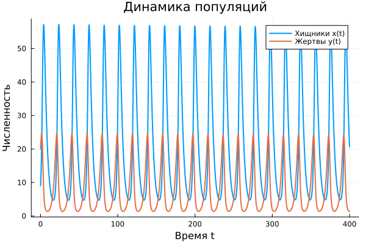
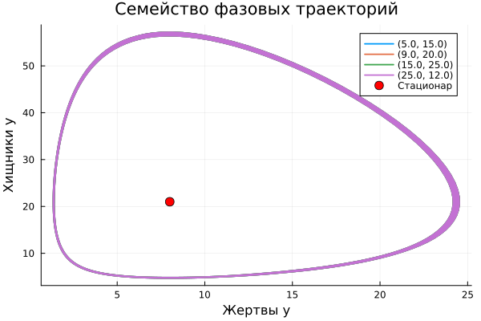

---
## Author
author:
  name: Машков Илья Евгеньевич
  email: 1132231984@rudn.ru
  affiliation:
    - name: Российский университет дружбы народов
      country: Российская Федерация
      postal-code: 117198
      city: Москва
      address: ул. Миклухо-Маклая, д. 6
## Title
title: Лабораторная работа №5
subtitle: Математическое моделирование
license: CC BY
date: 2026-09-04
date-format: "YYYY-MM-DD"
---

## Цель работы

Изучить модель Лотки-Вольтерры

## Выполнение лабораторной работы

{width=45%}

## Выполнение лабораторной работы

{width=45%}

## Выполнение лабораторной работы

{width=45%}

## Выполнение лабораторной работы

Стационарное состояние x* = 21.0, y* = 8.0

## Выводы

Во время выполнения данной ЛР я реализовал модель "хищник-жертва". Получил график динамики популяции, фазовый портрет и семейство фазовых траекторий.

