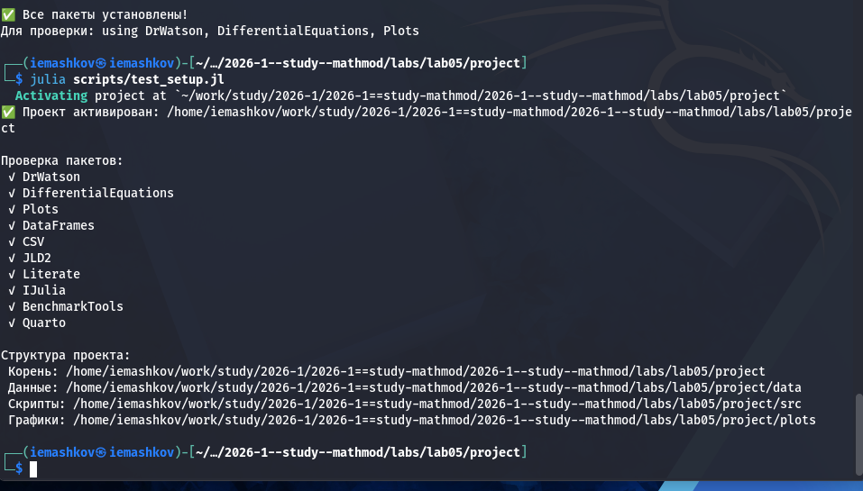
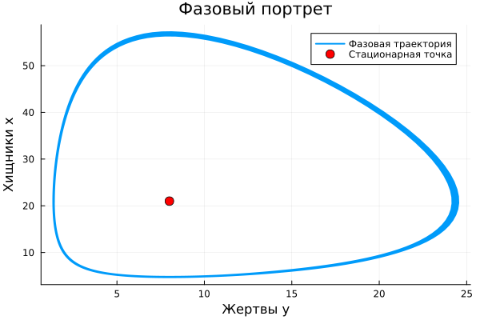

---
## Author
author:
  name: Машков И.Е.
  email: 1132231984@rudn.ru
  affiliation:
    - name: Российский университет дружбы народов
      country: Российская Федерация
      postal-code: 117198
      city: Москва
      address: ул. Миклухо-Маклая, д. 6

## Title
title: "Отчёт по лабораторной работе №6"
subtitle: "Математическое моделирование"
license: "CC BY"
---

# Цель работы

Изучить модель Лотки-Вольтерры

# Задание 

Для модели «хищник-жертва»:
dx/dt = -0.32x(t) + 0.04x(t)y(t)
dy/dt = 0.42y(t) - 0.02x(t)y(t)

Постройте график зависимости численности хищников от численности жертв, а также графики изменения численности хищников и численности жертв при следующих начальных условиях: x_0 = 9, y_0 = 20. Найдите стационарное состояние системы.

# Выполнение лабораторной работы

## Подготовка пространства

Создаю базовые скрипты для установки необходимых пакетов, проверки структуры и создания производных форматов ([рис. @fig-001]).

{#fig-001 width=70%}

## Решение задания

Создаю скрипт, который строит графики зависимости хищников от числа жертв, изменение численности хищников и численности жертв при начальных условиях, фазовый портрет. Также необходимо было найти стационарные точки. В итоге получаю график динамики популяции ([рис. @fig-002]), фазовый портрет ([рис. @fig-003]), а также семейство фазовых траекторий ([рис. @fig-004]). 
 
{#fig-002 width=70%}
 
{#fig-003 width=70%}
 
{#fig-004 width=70%}

Далее, с помощью tangle создаю производные форматы своего скрипта, в отчёте использую qmd версию:



# Выводы

Во время выполнения данной ЛР я реализовал модель "хищник-жертва". Получил график динамики популяции, фазовый портрет и семейство фазовых траекторий.

