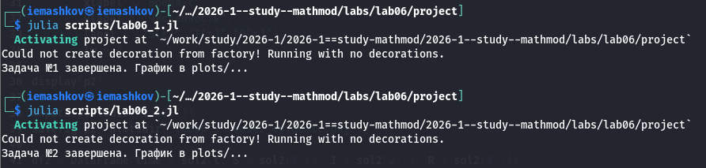
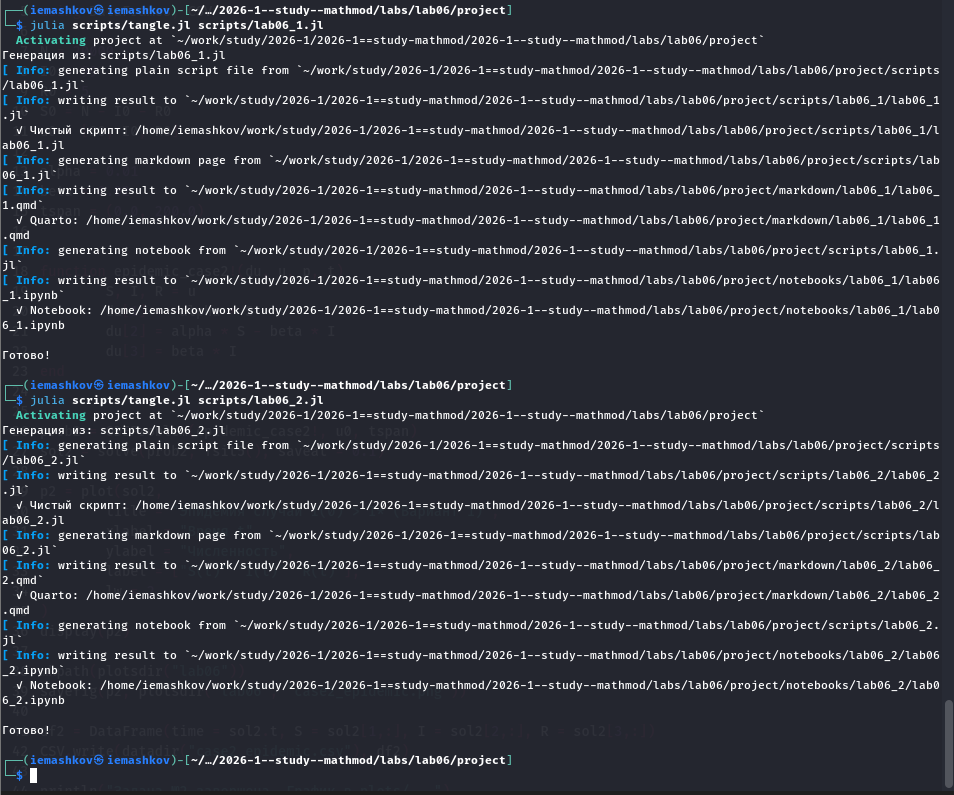

---
## Author
author:
  name: Машков И.Е.
  email: 1132231984@rudn.ru
  affiliation:
    - name: Российский университет дружбы народов
      country: Российская Федерация
      postal-code: 117198
      city: Москва
      address: ул. Миклухо-Маклая, д. 6

## Title
title: "Отчёт по лабораторной работе №6"
subtitle: "Математическое моделирование"
license: "CC BY"
---

# Цель работы

Целью данной лабораторной работы - изучить и реализовать на языке программирования Julia математическую модель распространения эпидемии в изолированной популяции (модель SIR). С помощью численного решения дифференциальных уравнений проанализировать динамику изменения численности трех групп населения: восприимчивых к болезни ($S$), инфицированных ($I$) и обладающих иммунитетом ($R$). Сравнить сценарии течения болезни в зависимости от выполнения условия критического порога заболеваемости $I^*$.

# Задание 

Постройте графики изменения числа особей в каждой из трех групп.
Рассмотрите, как будет протекать эпидемия в случае:
1) если $I(0) <= I^*$
2) если $I(0) > I^*$

# Выполнение лабораторной работы

Сначала создаём два скрипта для кодов ([рис. @fig-001]).

{#fig-001 width=70%}

После того, как я записал в них код, запустил оба скрипта ([рис. @fig-002]).

{#fig-002 width=70%}

После я произвёл преобразование их в .ipunb и .qmd формат с помощью другого скрипта ([рис. @fig-003]).

{#fig-003 width=70%}

## Задача №1 (Вариант 1)



## Задача №2 (Вариант 1)



# Выводы

В ходе выполнения лабораторной работы была построена и исследована математическая модель эпидемии.
