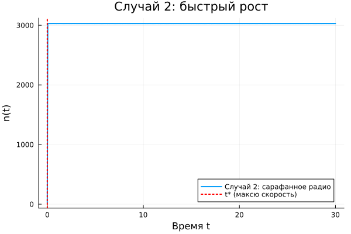
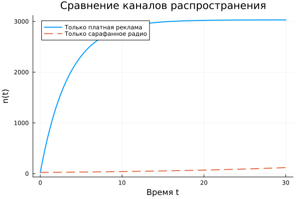

---
## Author
author:
  name: Машков Илья Евгеньевич
  email: 1132231984@rudn.ru
  affiliation:
    - name: Российский университет дружбы народов
      country: Российская Федерация
      postal-code: 117198
      city: Москва
      address: ул. Миклухо-Маклая, д. 6
## Title
title: Лабораторная работа №7
subtitle: Математическое моделирование
license: CC BY
date: 2026-09-04
date-format: "YYYY-MM-DD"
---

## Цель работы

Изучить модель распространения рекламы.

## Выполнение лабораторной работы

{width=45%}

## Выполнение лабораторной работы

{width=45%}

## Выполнение лабораторной работы

{width=45%}

## Выполнение лабораторной работы

Максимальная скорость распространения рекламы для случая 2 = 0.00422854538125659

Численная проверка дала следующую скорость: t* = 0.0

Значение n в этот момент = [24.0 3030.16989772527 3029.3083179956034 3030.7370671793915

## Выводы

Во время выполнения данной ЛР я реализовал модель распространения рекламы. Получил графики для сравнения разных случаев, указанных в задании.

