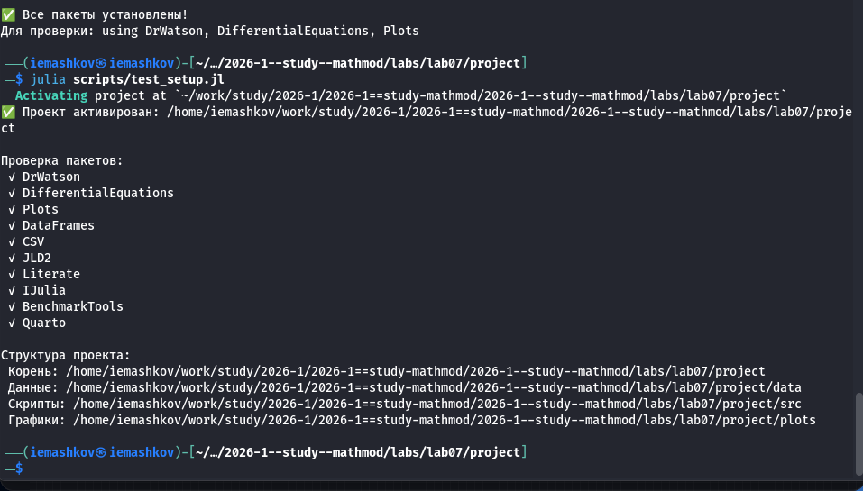
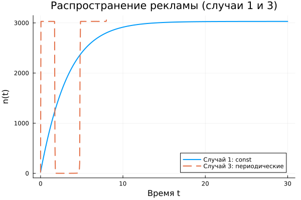

---
## Author
author:
  name: Машков И.Е.
  email: 1132231984@rudn.ru
  affiliation:
    - name: Российский университет дружбы народов
      country: Российская Федерация
      postal-code: 117198
      city: Москва
      address: ул. Миклухо-Маклая, д. 6

## Title
title: "Отчёт по лабораторной работе №7"
subtitle: "Математическое моделирование"
license: "CC BY"
---

# Цель работы

Изучить модель распространения рекламы.

# Задание 

Вариант № 45

Постройте график распространения рекламы, математическая модель которой описывается следующим уравнением:

1. dn/dt = (0.288 + 0.000018n(t))(N - n(t))

2. dn/dt = (0.000018 + 0.377*n(t))(N - n(t))

3. dn/dt = (0.1*t + 0.4*cos(t)*n(t))(N - n(t))

При этом объем аудитории N = 3030, в начальный момент о товаре знает n0 = 24 человек. Для случая 2 определите в какой момент времени скорость распространения рекламы будет иметь максимальное значение.

# Выполнение лабораторной работы

## Подготовка пространства

Создаю базовые скрипты для установки необходимых пакетов, проверки структуры и создания производных форматов ([рис. @fig-001]).

{#fig-001 width=70%}

## Решение задания

Создаю скрипт, который строит графики и производит рассчёты для трёх разных случаев: с постоянными коэффициентами, с доминированием сарафанного радио и с периодической функцией. Дополнительно я произвёл рассчёты для вычисления максимальной скорости распространения рекламы для второго случая, а также произвёл сравнения двух каналов распросранения: платная реклама и сарафанное радио. Получил следующие графики: график-сравнение для 1-го и 2-го случая ([рис. @fig-002]), график для случая 2 с максимальной скоростью распространения осведомлённости ([рис. @fig-003]), график-сравнение эффективности двух каналов ([рис. @fig-004]). 
 
{#fig-002 width=70%}
 
{#fig-003 width=70%}
 
{#fig-004 width=70%}

Далее, с помощью tangle создаю производные форматы своего скрипта, в отчёте использую qmd версию:



# Выводы

Во время выполнения данной ЛР я реализовал модель распространения рекламы. Получил графики для сравнения разных случаев, указанных в задании.

