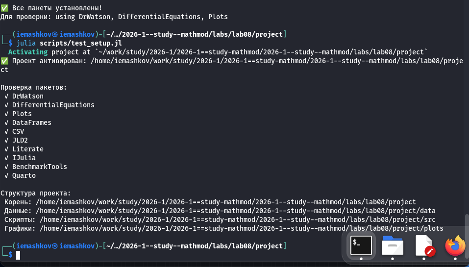
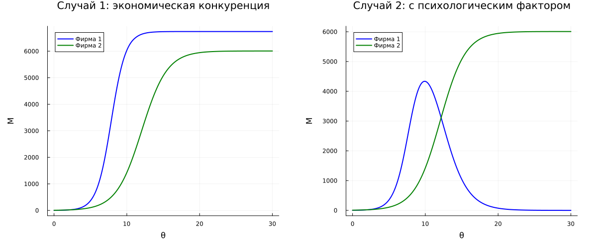

---
## Author
author:
  name: Машков И.Е.
  email: 1132231984@rudn.ru
  affiliation:
    - name: Российский университет дружбы народов
      country: Российская Федерация
      postal-code: 117198
      city: Москва
      address: ул. Миклухо-Маклая, д. 6

## Title
title: "Отчёт по лабораторной работе №7"
subtitle: "Математическое моделирование"
license: "CC BY"
---

# Цель работы

Изучить модель конкуренции двух фирм.

# Задание 

Изучить два случая:

1. Когда между фирмами идёт чисто экономическая вражда.

2. Когда добавляется социально-психологический фактор

# Выполнение лабораторной работы

## Подготовка пространства

Создаю базовые скрипты для установки необходимых пакетов, проверки структуры и создания производных форматов ([рис. @fig-001]).

{#fig-001 width=70%}

## Решение задания

В 45-ом варианте мне необходимо было изучить динамику конкуренции фирм при чистой экономической вражде и с учётом социально-психологического фактора, т.е. когда потребитель будет готов покупать только товар определённой фирмы, не смотря на его цену. Я создал скрипт, который реализует эти два случая и мы получаем общий график сравнения ([рис. @fig-002]), а также стационарную точку для случая 1, как и говорилось в задании. 
 
{#fig-002 width=70%}

Далее, с помощью tangle создаю производные форматы своего скрипта, в отчёте использую qmd версию:



# Выводы

Во время выполнения данной ЛР я реализовал модель конкуренции двух фирм при экономическом факторе и социально психологическом. 

